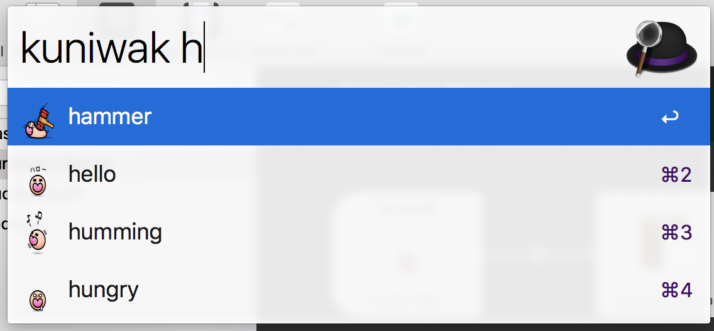

# Kuniwak's stamp selector for alfred

-> [Kuniwak's stamp](https://github.com/Kuniwak/stamp/)

# Install

1. Download latest `.alfredworkflow` file from [Release page](https://github.com/kikuchy/kuniwak-stamp-alfred/releases).
2. Open it.
3. Type `kuniwak` at Alfred.
4. Enjoy!

# License

This work is licensed under the Creative Commons Attribution-NonCommercial-NoDerivatives 4.0 International License.
To view a copy of this license, visit http://creativecommons.org/licenses/by-nc-nd/4.0/.
